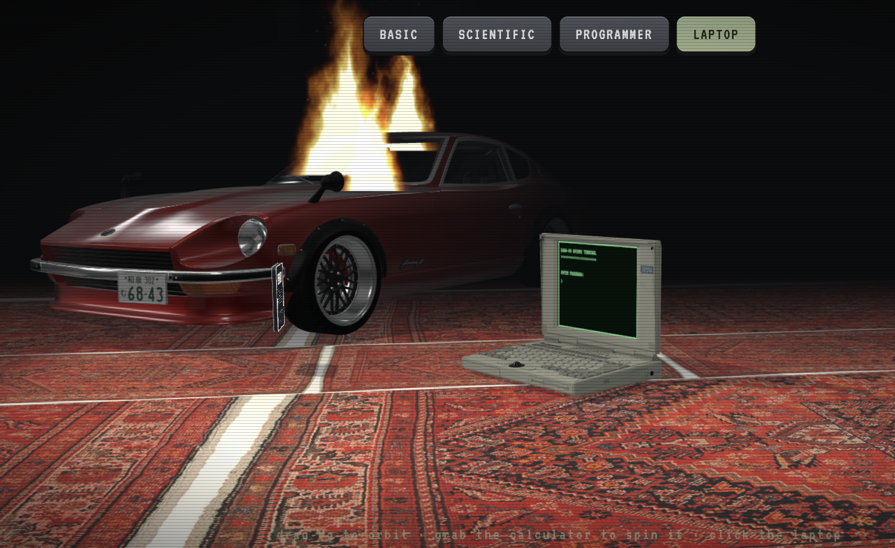
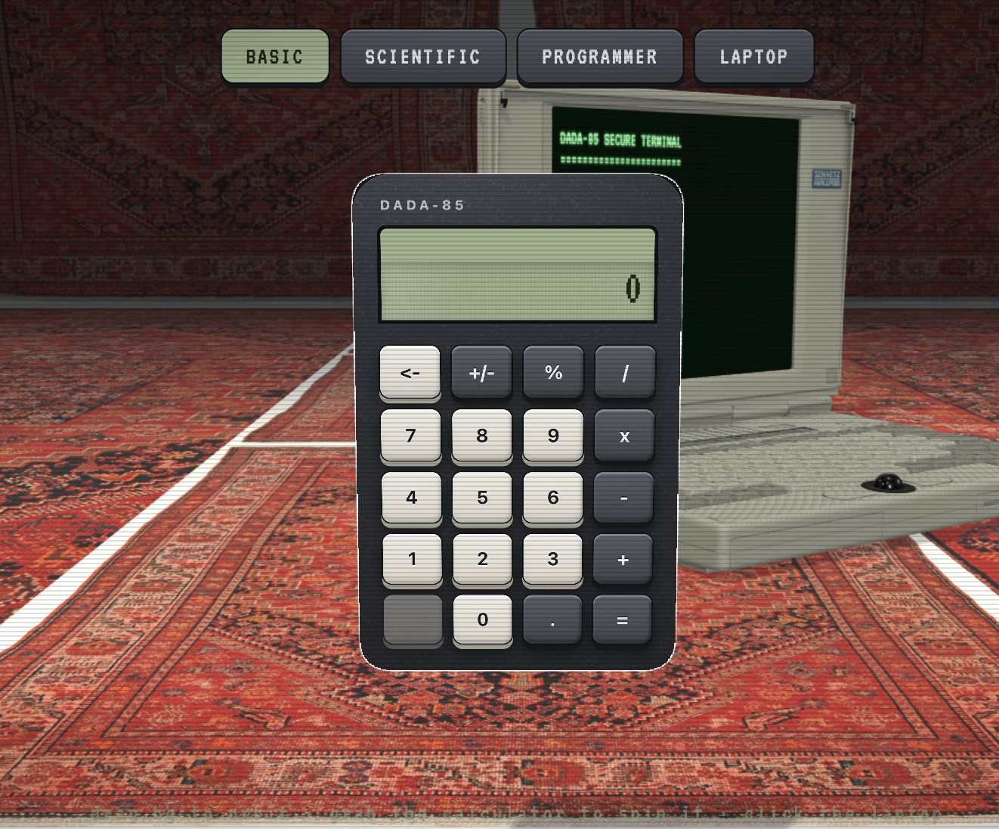
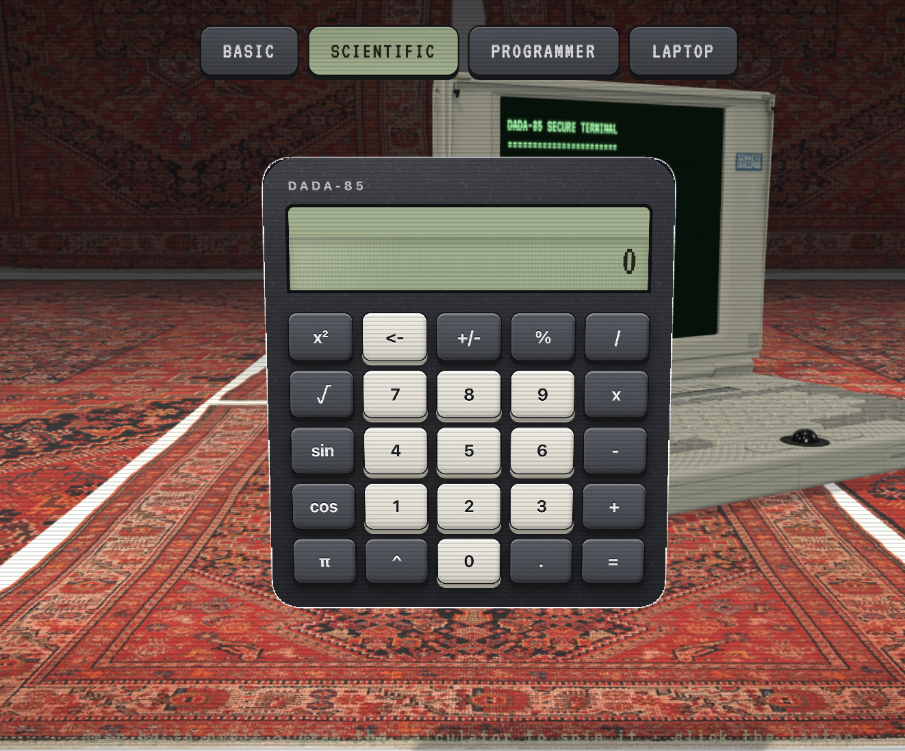
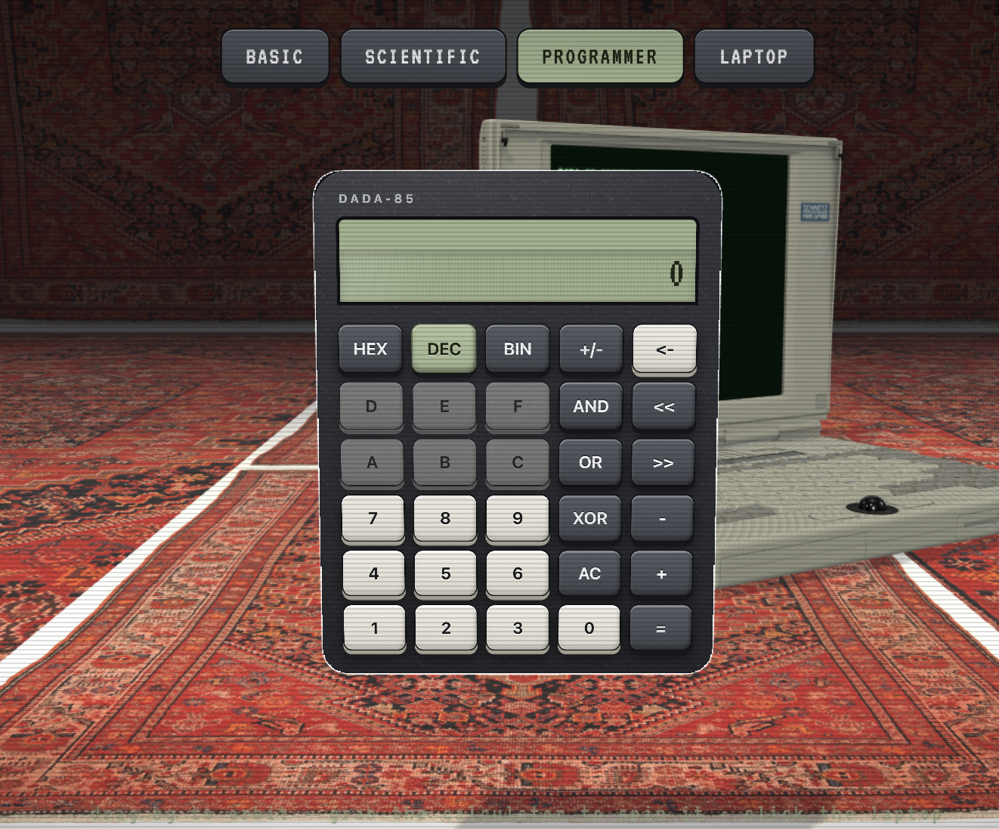

# DADA-85

DADA-85 is a calculator app that lives in a three.js room, next to a vintage
laptop and a burning Nissan 240Z. You can drag the background to orbit, grab
the calculator to spin it, and click the laptop (or the LAPTOP tab) to walk up
to its terminal. Built with React 19, TypeScript, and Vite, styled with
Tailwind and daisyUI.



## For my dad

One of the first apps anyone writes is a calculator app.

My dad suffered a traumatic brain injury in August 2025 and remained in a
vegetative state. While he was in that condition we found out he had cancer.
The cancer progressed quickly, and due to his condition he was unable to
receive any treatment for it. It ultimately took his life in June.

So when I think way back to that young kid learning to code, I think about
'The Calculator App'. With great love, I dedicate this project to him.

Anything I did was for him and my mom. Always wanting to make them proud.
He was the greatest man I have ever met, and probably ever will. He was the
most charming person. People loved him, and I always wish everyone could have
met him. I am sure he would have shown you so much love, and I know how much
you would have loved him.

I miss him every day.

## Features

- Three calculators on one config-driven core:
  - **Basic**: add, subtract, multiply, divide, modulo, sign toggle, decimals, backspace
  - **Scientific**: adds `x²`, `^`, `√`, `sin`, `cos`, `π`
  - **Programmer**: HEX/DEC/BIN modes with live base conversion, bitwise AND/OR/XOR and shifts; digit keys invalid in the current base disable themselves
- Full keyboard support: digits and operators as-is, `*` for multiply, Enter for `=`, Backspace to delete, Escape to clear, plus `&`/`|`/`^` in programmer mode
- The 3D room: orbit the camera, grab the calculator to spin it, click the laptop and the camera flies over to its terminal

| Basic | Scientific | Programmer |
| --- | --- | --- |
|  |  |  |

## Getting started

Node is pinned in `.nvmrc` (v26):

```sh
nvm use
npm install
npm run dev
```

Other scripts:

- `npm test`: vitest with jsdom and React Testing Library (`npm run test:watch` for watch mode)
- `npm run build`: type-check, then production build
- `npm run lint`: oxlint
- `npm run preview`: serve the production build

## Project structure

```text
src/
  components/
    ui/
      Button.tsx                # generic button primitive
      CalculatorBack.tsx        # back face of the calculator card
      stage3d/                  # lazy-loaded three.js room everything sits in
        Stage3D.tsx             # React entry: renderer + scene lifecycle
        config.ts / types.ts    # scene constants and shared types
        scene/                  # room, props (car, laptop, rugs), calculator card
        effects/                # burning car: flame + embers
        shaders/                # GLSL: flame, smoke, noise
        interaction/            # camera flight, grab-rotate, laptop focus, gesture gate
        terminal/               # laptop LCD texture + terminal screen
        utils/                  # dispose/freeze helpers, rounded-rect geometry
    calculator/                 # generic calculator core (no feature knowledge)
      engine.ts                 # state machine + pure helpers, config-driven
      Calculator.tsx            # generic component: config in, calculator out
      keys.ts                   # Key type + layout helpers (k, backspaceKey)
      KeyPad.tsx                # keypad grid of Buttons
      Display.tsx / OperationView.tsx
  features/BasicCalculator/     # config.ts + BasicCalculator.tsx (one-liner)
  features/ScientificCalculator/# same core, extended with x², ^, √, sin, cos, π
  features/ProgrammerCalculator/# same core again: hex/bin/dec + bitwise ops
test/                           # vitest + testing-library tests
```

## Design notes

### The engine

The whole calculator engine (`components/calculator/engine.ts`) is 141 lines.
State is four strings: `left`, `operator`, `right`, and the previous operation
shown above the display. Operands stay strings until an operator forces a
parse. That sounds like a detail, but it is what later makes the programmer
calculator possible: a string like `"FF"` has no fixed meaning until something
interprets it under a base.

Every key press resolves in one of three ways, in order: a command from the
config, a binary operation from the config, or a digit appended to the current
operand. Operations are a strategy map (`{'x': (a, b) => a * b}`). Commands
are functions from state to state that also receive the engine, and factories
build the common ones (`{'√': unaryCommand(Math.sqrt), 'π':
constantCommand(Math.PI)}`). The built-in keys (`=`, `AC`, `+/-`, backspace)
are commands registered the same way, so a feature can override them: the
programmer calculator redefines `AC` to reset everything except the current
base. A new calculator is just a config object; the scientific one is 25
lines and rewrites nothing.

The programmer calculator is the stress test of that design. It extends the
state shape with `base` (the engine is generic over the state type) and
supplies `parseOperand` and `formatResult` hooks that read it: `parseInt(value,
base)` in, `toString(base)` out, with `(x + y) | 0` keeping arithmetic in
32-bit integer range to match the bitwise operators. Switching base re-parses
both operands under the old base and reformats them under the new one, so you
can type `255`, hit HEX, and keep going from `FF` mid-expression. The keypad
is a function of state, so hex digits disabling themselves in DEC mode and
the highlighted base key are derived data, not effect code. The default
`formatResult` is also what fixes float ugliness: `0.1 + 0.2` shows `0.3`,
and division by zero shows `Error` instead of `Infinity`.

### The 3D stage

The stage (`components/ui/stage3d/`) draws two scenes through one camera: a
WebGL scene for the room, and a CSS3D scene holding the calculator's front and
back faces, which are real DOM elements (`CSS3DObject`). Every key stays
clickable, and the React component never knows it's in 3D. The transparent
WebGL canvas sits on top of the CSS layer, which creates an occlusion problem:
meshes need to pass in front of a DOM element that is actually behind the
canvas. The trick is a pair of invisible quads in the GL scene, placed exactly
where the faces are, that render fully transparent pixels with blending off.
They punch a hole in the canvas where the calculator sits, while still writing
depth, so anything nearer to the camera can cover the hole again.

The case around the faces is real geometry, an extruded rounded rectangle,
and it is rebuilt from measurements: a `ResizeObserver` watches the DOM face
and regenerates the body whenever React renders a different size. The
programmer calculator's wider keypad gets a wider case, and the floor drops
to stay under it.

Pointer input is an arbitration problem, because the same drag could mean
orbit the camera, spin the calculator, or click a key. A pointerdown on a face
disables `OrbitControls` for that gesture. Grab-rotate ignores movement under
5 px, so a slightly sloppy click still counts as a click. And when a real drag
ends, a capture-phase listener swallows the click event that follows, so
releasing a spin never presses the button under the cursor. The camera
flights (the LAPTOP tab, or clicking the laptop) use a framerate-independent
exponential lerp and cancel the moment you start orbiting, so the camera
never fights you.

The renderer works on a budget. Static objects have their matrices frozen
(`matrixAutoUpdate = false`), shadow maps re-render only when something
actually moves, the terminal screen repaints at 15 fps, pixel ratio is capped
at 1.5, and the environment map is generated 400 ms after first paint so it
never blocks boot. The boot bar is honest: it is driven by the three.js
loading manager, and the scene is revealed only after assets are loaded and
shaders are compiled (`compileAsync`), so there is no first-frame stutter. If
WebGL is unavailable, the stage falls back to rendering the calculator flat.
The whole stage is lazy-loaded with `React.lazy`, so three.js (about 650 kB
minified) ships in its own chunk and the initial bundle stays small.

## Credits

- Classic laptop model from [Poly Haven](https://polyhaven.com), CC0.
- Flame shader inspired by [mattatz/THREE.Fire](https://github.com/mattatz/THREE.Fire).
- Room texture based on ["Kuuma YE rug by Kristiina Lassus"](https://sketchfab.com/3d-models/kuuma-ye-rug-by-kristiina-lassus-5f5de1ba643746fc9da76d2cac94fbb3) by [mfb64](https://sketchfab.com/mfb64), [CC-BY-4.0](http://creativecommons.org/licenses/by/4.0/). The runner is based on ["Persian Malayer Carpet"](https://sketchfab.com/3d-models/persian-malayer-carpet-1120ca810d0c46289d3b7071103067ac) by the same artist (CC-BY-4.0).
- The car is ["Nissan Fairlady Z S30(240Z) 1978"](https://sketchfab.com/3d-models/nissan-fairlady-z-s30240z-1978-0d9286ebb8cc426e993e1d398b874a34) by [Lexyc16](https://sketchfab.com/Lexyc16), licensed [CC-BY-NC-4.0](http://creativecommons.org/licenses/by-nc/4.0/). That license is **non-commercial**: replace the model if this site is ever used commercially.
